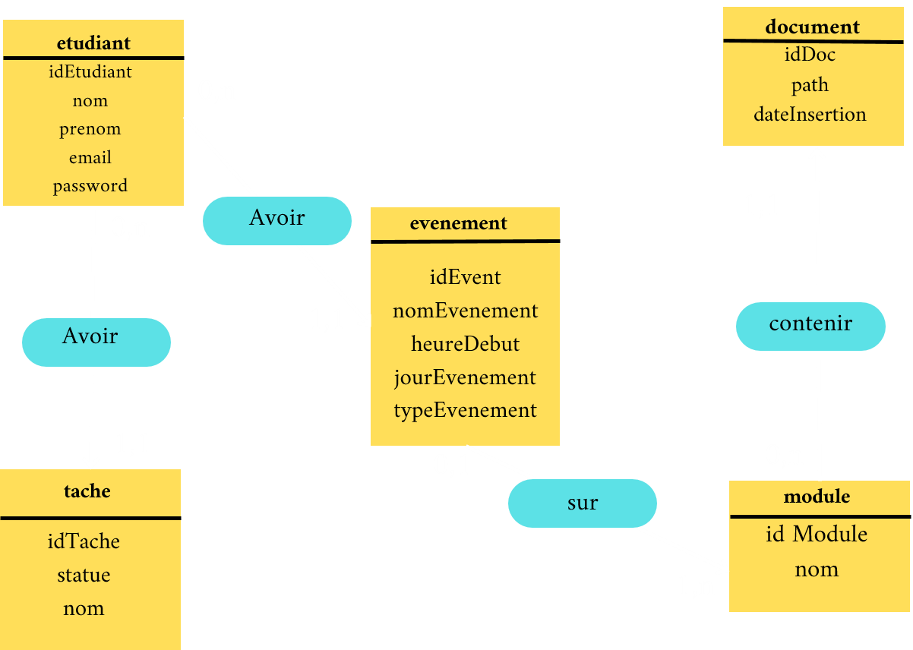

# STUDY MATE

### Projet en Programmation web

 

| Realisé par: | Encadré par: |
|--------------|--------------|
| - IMANI Mourad | - EL BANNAY |
| - ICHMAWIN Anas | |
| - HARIT Ali | |
| - FATIH Mohamed-Amine | |
| - MOUSSALIM Sohail ||

## Objectif StudyMate
Le projet vise à développer une application web pour aider les étudiants universitaires à gérer leurs cours, organiser leur préparation et optimiser leur travail. L'application offrira diverses fonctionnalités permettant une gestion efficace du temps, des projets, des modules et des tâches.

## Fonctionalités
- #### Gestion du Temps : Planning hebdomadaire des cours et des travaux.
- #### Gestion des Modules : Accès aux informations sur les modules et cours.
- #### Ressources et documents de cours consultables.
- #### Gestion des Tâches : Création et gestion des listes de tâches.

## Technologies Utilisées
- #### <u>BOOTSTRAP</u> : Utilisé pour la conception de l'interface utilisateur, assurant une expérience utilisateur fluide et réactive.

- #### <u>LARAVEL</u> : Utilisé pour la gestion de la logique serveur, des bases de données et de la sécurité de l'application.

- #### <u>HTML / CSS / JavaScript</u> : Langages de base pour le développement front-end.

- #### <u>MySQL</u> : Système de gestion de base de données relationnelle pour stocker les données des étudiants, des cours, des projets, et des tâches.

## Plan de Développement
- ### <u>Phase 1 </u> : Analyse des Besoins
    - Identification des besoins des utilisateurs.
    - Spécification des exigences fonctionnelles et non fonctionnelles.

- ### <u>Phase 2 </u> : Conception
    - Modélisation de la base de données.
    - Design de l'interface utilisateur avec Bootstrap.

- ### <u>Phase 3 </u> : Développement
    - Implémentation du back-end avec Laravel.
    - Développement du front-end avec HTML, CSS, JavaScript et Bootstrap.
    - Intégration des fonctionnalités de gestion du temps, des projets, des modules, et des tâches.
    
## MCD
